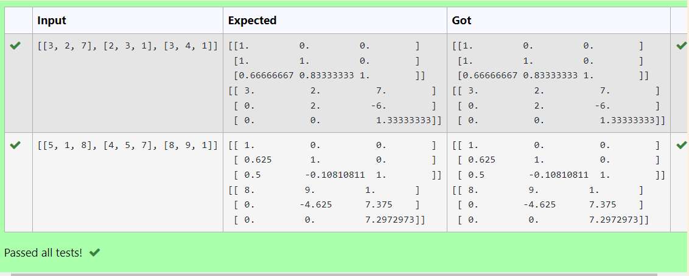
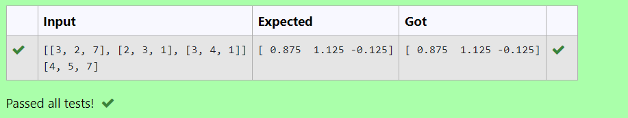

# LU Decomposition 

## AIM:
To write a program to find the LU Decomposition of a matrix.

## Equipments Required:
Hardware – PCs
Anaconda – Python 3.7 Installation / Moodle-Code Runner
## Algorithm
Step 1: Import the numpy module to use the built-in functions for calculation

Step 2: Prepare the lists from each linear equations and assign in np.array()

Step 3: Using the np.linalg.solve(), we can find the solutions.

Step 4: End the program

## Program:
LU-Decomposition:
 Developed by: Berjin Shabeck
 Ref no: 22007550
(i) To find the L and U matrix

/*
## Program to find the L and U matrix.
# Developed by: Berjin Shabeck
# RegisterNumber: 22007550
``` python
import numpy as np
from scipy.linalg import lu
A = np.array(eval(input()))
P,L,U=lu(A)
print(L)
print(U)
(ii) To find the LU Decomposition of a matrix
```
 ## Program to find the LU Decomposition of a matrix.
 # Developed by: Berjin Shabeck
 # RegisterNumber: 22007550
``` python
import numpy as np 
from scipy.linalg import lu_factor, lu_solve
A = np.array(eval(input()))
b = np.array(eval(input()))
lu, piv = lu_factor(A)
x = lu_solve((lu, piv), b)
print(x)
```
### Output:






## Result:
Thus the program to find the LU Decomposition of a matrix is written and verified using python programming.

